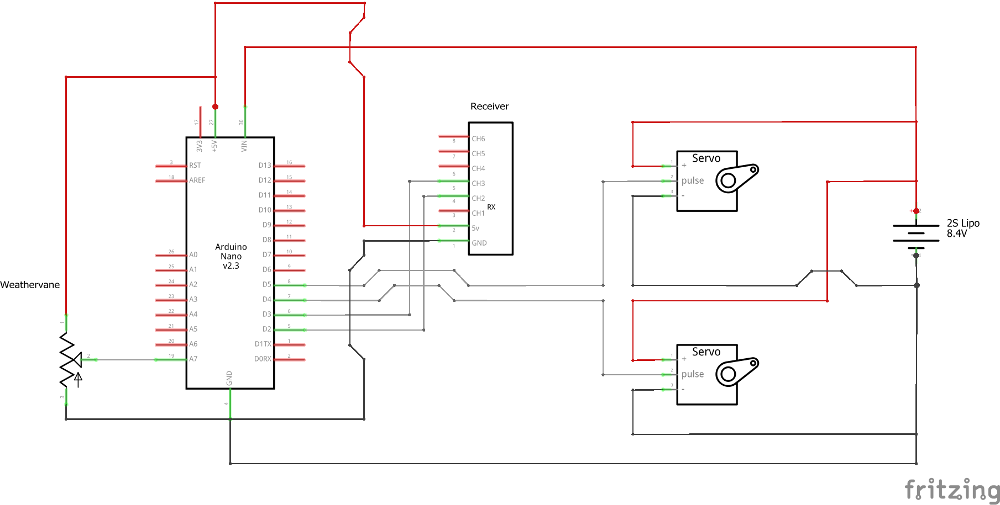

# Tail-lessStability
This Arduino sketch is a servo controller for a tail-less airplane that is stabilized about the pitch-axis with an angle-of-attack sensor. 

The simplest angle-of-attack sensor is a simple low-friction potentiometer attached to a weathervane. As the weathervane will closely follow the local airflow, it can be used as a reference from which to measure the angle of attack. This signal is then used in a PID controller with constant coefficients, with the signal of the sensor acting as the proportional term of the controller. By adjusting the appropriate coefficients, the static and dynamic stability of the aircraft can be greatly enhanced. This permits the center of mass of the vehicle can be moved aft which allows a reduction or complete elimination any reflex in the elevons. The result is an aircraft with a greater lift-to-drag ratio than what is otherwise possible with passive stability.  

The program is designed to receive 2 PWM inputs from an RC receiver and an analog signal, and outputs two PWM signals for two servos. It is assumed the aircraft is controlled with two elevons. It was written for an Arduino Nano but it should be compatible with other boards. It requires the "PinChageInterrupt" library found here:

  https://www.arduino.cc/reference/en/libraries/pinchangeinterrupt/

For previous projects that inspired this work, please see these links:

  http://www.charlesriverrc.org/articles/asfwpp/lelke_activepitch.htm
  
  https://www.youtube.com/watch?v=JfKrUbJYk74
  
See the schematic below for the required circuit:

